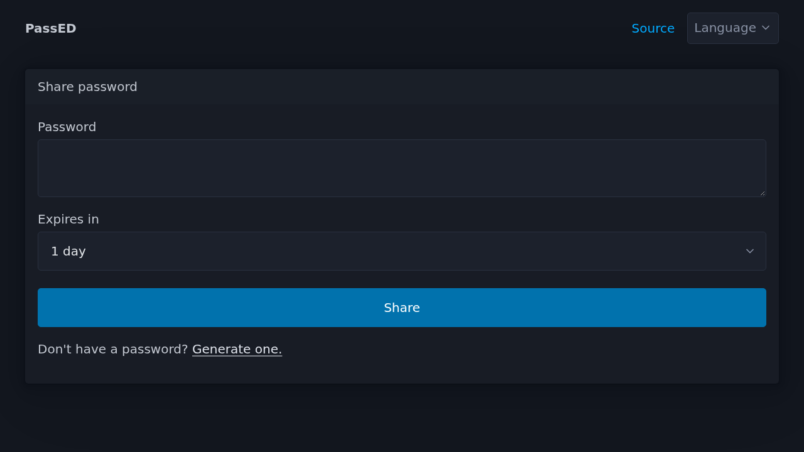

# PassED

Did you ever run into the issue of needing to share a password with someone securely?

You want to share it using email, but there it will surely get logged along the way.

You want to share it using WhatsApp, but there it will show up in the notifications for everyone to read.

You want to share it on paper, but everyone can read that too.

PassED solves this issue by allowing you to generate a URL with your password. Links allow **one view by default**; you can allow additional views (up to 10) when sharing. The browser encrypts the secret with AES-256-GCM before it leaves your device. The server stores only ciphertext and deletes it after the last remaining view or when it expires.



The original [1e99/passed](https://git.1e99.eu/1e99/passed) repository currently appears to be down ([web archive](https://web.archive.org/web/20251118132530/https://git.1e99.eu/1e99/passed)). This TypeScript [Nitro](https://nitro.build) reimplementation was created to continue the idea.

It is written in TypeScript so you can run it on serverless platforms such as [Vercel](#deploy-on-vercel), [Cloudflare](https://www.cloudflare.com), and [Netlify](https://www.netlify.com).

## How it works

When you share a password:

1. The browser generates an AES-256-GCM key and a 12-byte IV.
2. The password is encrypted in the browser using the generated key (Web Crypto API).
3. The encrypted password is uploaded to the server, which responds with an ID to uniquely identify the password.
4. The server replies with an id. The share link keeps the key in the URL fragment: `#id:key:iv`.

When someone opens the link:

1. The browser checks that the id still exists (`HEAD /api/password/:id`) without deleting it.
2. After they confirm, it fetches the ciphertext (`GET /api/password/:id`) and the server consumes one view (deleting the share on the last view).
3. The browser decrypts the password locally with the key and IV from the URL.

Browsers do not send the `#fragment` to the server, so a malicious host cannot decrypt the password.

As the website relies on the [Web Crypto API](https://developer.mozilla.org/en-US/docs/Web/API/Web_Crypto_API) it requires a [secure context](https://developer.mozilla.org/en-US/docs/Web/Security/Secure_Contexts). In other words you must setup a reverse proxy for HTTPS, or access the site via `localhost`.

## Configuration

Environment variables are validated at build time or startup time. Copy `.env.example` or set them in the process environment.

| Variable                                                                                  | Default                  | Notes                                                                                                                                |
| ----------------------------------------------------------------------------------------- | ------------------------ | ------------------------------------------------------------------------------------------------------------------------------------ |
| `PASSED_MAX_LENGTH`                                                                       | `12288`                  | Maximum ciphertext length in bytes (characters of the uploaded Base64 string).                                                       |
| `PASSED_MAX_SECRETS`                                                                      | `4096`                   | Maximum live shares. Set `0` to **opt in** to unlimited. `POST /api/password` returns 507 when full.                                 |
| `PASSED_STORE_TYPE`                                                                       | `redis`                  | `redis` or `upstash`                                                                                                                 |
| `PASSED_STORE_REDIS_URL`<br/>or `REDIS_URL`                                               | `redis://127.0.0.1:6379` | Redis 8+ URL when `PASSED_STORE_TYPE=redis`. First set wins. Use AUTH (`redis://:password@host`) or TLS (`rediss://`) in production. |
| `PASSED_STORE_UPSTASH_URL`<br/>or `UPSTASH_REDIS_REST_URL`<br/>or `KV_REST_API_URL`       | —                        | Upstash REST URL when `PASSED_STORE_TYPE=upstash`. First set wins.                                                                   |
| `PASSED_STORE_UPSTASH_TOKEN`<br/>or `UPSTASH_REDIS_REST_TOKEN`<br/>or `KV_REST_API_TOKEN` | —                        | Upstash REST token when `PASSED_STORE_TYPE=upstash`. First set wins.                                                                 |
| `PORT` / `NITRO_PORT`                                                                     | `3000`                   | Listen port.                                                                                                                         |

Unlimited live shares is opt-in. Set `PASSED_MAX_SECRETS=0` only if you accept unbounded Redis growth. Public or production instances should keep a finite cap (the default) or put a rate limit in front of `POST /api/password`.

## Deploy on Vercel

Vercel is serverless, so use [Upstash](#upstash) (`PASSED_STORE_TYPE=upstash`), not Redis TCP. See the note under [Redis](#redis).

[](https://vercel.com/new/clone?repository-url=https%3A%2F%2Fgithub.com%2FMathieu-COSYNS%2Fpassed&repository-name=passed&env=PASSED_STORE_TYPE&envDefaults=%7B%22PASSED_STORE_TYPE%22%3A%22upstash%22%7D&project-name=passed&demo-title=Passed&demo-description=Share+a+password+with+a+one-time+URL&demo-url=https%3A%2F%2Fpassed-demo.vercel.app%2F&demo-image=https%3A%2F%2Fgithub.com%2FMathieu-COSYNS%2Fpassed%2Fraw%2Fmain%2Ftest%2Fe2e%2Fshare.test.ts-snapshots%2F01-share-form-dark-linux.png)

The button clones this repository and sets `PASSED_STORE_TYPE=upstash`.

### Connect Upstash Redis

1. Open the new project in Vercel. Install [Upstash for Redis](https://vercel.com/marketplace/upstash/upstash-kv), or go to **Storage** and create or connect a database.
1. Choose **Create New Upstash Account** (Vercel manages the database) or **Link Existing Upstash Account** (use one from the [Upstash Console](https://console.upstash.com)).
1. Create or select a Redis database in a region close to your Vercel deployment. Keep eviction off unless you accept that secrets may disappear.
1. Connect the database to this project. Vercel injects `KV_REST_API_URL` / `KV_REST_API_TOKEN` and/or `UPSTASH_REDIS_REST_URL` / `UPSTASH_REDIS_REST_TOKEN`. PassED reads those names automatically ([Configuration](#configuration)).
1. Redeploy so the variables are available at build time. The first deploy from the button can fail until the database is connected.

You can instead paste REST credentials yourself in **Settings → Environment Variables**. After any env change, redeploy.

## Docker

The published image is [`ghcr.io/mathieu-cosyns/passed`](https://github.com/Mathieu-COSYNS/passed/pkgs/container/passed). A GitHub Release `v1.0.0` (matching `package.json`) publishes `latest`, `1`, `1.0`, and `1.0.0` (a leading `v` on the git tag is stripped). Prereleases such as `v1.0.0-rc.1` get only that exact tag.

The image listens on port 3000 as the non-root `node` user (`PORT=3000` in the Dockerfile). Map host 80 to container 3000 (`-p 80:3000`). Put a reverse proxy with TLS in front in production.

```sh
docker pull ghcr.io/mathieu-cosyns/passed:1.0.0
```

## Storage backends

Secrets are stored in Redis, using an atomic operation to guarantee that each link can only be accessed the allowed number of times, even if multiple users try to view it at exactly the same moment. This strong guarantee is possible because the operation that checks and decrements the view count happens in a single, indivisible command on the Redis server itself. If the same logic were implemented asynchronously outside of a single Redis instance, for example with non-atomic replicated Redis or Upstash setups such as an Upstash Global Database, race conditions could occur and a link could be viewed more times than intended.

### Redis

> [!NOTE]
> Prefer this backend for Docker and other long-running Node processes. Do not use it on Vercel, Cloudflare, or Netlify: the Node Redis client opens a TCP connection, which Cloudflare Workers do not support, and short-lived serverless isolates cannot keep a useful connection pool. Use [Upstash](#upstash) there instead.

Requires **Redis 8+**. Lua scripts use Redis JSON commands (`JSON.SET`, `JSON.GET`, `JSON.NUMINCRBY`), which are built into Redis 8. Redis 7, Valkey, and other servers without those commands will fail.

Encrypted secrets are stored in a Redis database.

When Redis hits [`maxmemory`](https://redis.io/docs/latest/develop/reference/eviction/) with `noeviction` (as in the examples below), you cannot save new secrets, but existing links still work. Other eviction policies remove secrets to make room, so some links may stop working before anyone opens them.

Without a volume on `/data` and `--appendonly yes`, restarting Redis drops live shares.

Local `compose.yaml` runs Redis 8 on `127.0.0.1` with no AUTH, and starts the app only after Redis accepts PING. That is fine on loopback. Do not publish an unauthenticated Redis port on a public network.

For production, require AUTH, use TLS (`rediss://`) when the connection leaves a private network, or use managed Redis / [Upstash](#upstash) instead of an open `redis://` URL:

```sh
docker run --rm -p 80:3000 \
  -e PASSED_STORE_TYPE=redis \
  -e PASSED_STORE_REDIS_URL=rediss://:YOUR_PASSWORD@redis.example.com:6379 \
  ghcr.io/mathieu-cosyns/passed:1.0.0
```

```yaml
services:
  redis:
    image: redis:8-alpine
    command:
      - redis-server
      - --requirepass
      - ${REDIS_PASSWORD}
      - --appendonly
      - "yes"
      - --maxmemory
      - 256mb
      - --maxmemory-policy
      - noeviction
    volumes:
      - redis-data:/data
    healthcheck:
      test:
        [
          "CMD",
          "redis-cli",
          "--no-auth-warning",
          "-a",
          "${REDIS_PASSWORD}",
          "ping",
        ]
      interval: 1s
      timeout: 3s
      retries: 10
  passed:
    image: ghcr.io/mathieu-cosyns/passed:1.0.0
    ports:
      - "80:3000"
    environment:
      PASSED_STORE_TYPE: redis
      PASSED_STORE_REDIS_URL: redis://:${REDIS_PASSWORD}@redis:6379
    depends_on:
      redis:
        condition: service_healthy

volumes:
  redis-data:
```

To run the app container against local Compose Redis (no AUTH, host loopback only):

```sh
docker run --rm -p 80:3000 \
  -e PASSED_STORE_TYPE=redis \
  -e PASSED_STORE_REDIS_URL=redis://host.docker.internal:6379 \
  ghcr.io/mathieu-cosyns/passed:1.0.0
```

### Upstash

Encrypted secrets are stored in an Upstash database.

Upstash databases have a max data size per plan. With [eviction](https://upstash.com/docs/redis/features/eviction) off (the default), you cannot save new secrets ([`ERR DB capacity quota exceeded`](https://upstash.com/docs/redis/troubleshooting/db_capacity_quota_exceeded)), but existing links still work. If you enable eviction, Upstash removes secrets at random, so some links may stop working before anyone opens them. [Auto Upgrade](https://upstash.com/docs/redis/features/auto-upgrade), if enabled, can raise the plan so you can keep saving secrets.

```sh
docker run --rm -p 80:3000 \
  -e PASSED_STORE_TYPE=upstash \
  -e PASSED_STORE_UPSTASH_URL=https://example.upstash.io \
  -e PASSED_STORE_UPSTASH_TOKEN=... \
  ghcr.io/mathieu-cosyns/passed:1.0.0
```

```yaml
services:
  passed:
    image: ghcr.io/mathieu-cosyns/passed:1.0.0
    ports:
      - "80:3000"
    environment:
      PASSED_STORE_TYPE: upstash
      PASSED_STORE_UPSTASH_URL: https://example.upstash.io
      PASSED_STORE_UPSTASH_TOKEN: ...
```

## Local development

Requires Node.js 22+ and Redis 8+.

```sh
docker compose up redis -d
pnpm install
pnpm dev
```

Open <http://localhost:3000>

```sh
pnpm test
pnpm build
pnpm preview
```

`pnpm test` expects Redis at `PASSED_STORE_REDIS_URL` or `REDIS_URL` (default `redis://127.0.0.1:6379`). If nothing is listening, it starts `redis:8-alpine` with Docker.

To build the image locally:

```sh
docker bake
```

That tags `passed:local`.

Same image without Bake: `docker build -t passed:local .`

## Project layout

App code lives in `src/`. The browser UI is in `public/`. Tests are in `test/`.

```text
src/
  env.ts             Environment validation (t3-env)
  plugins/           Nitro plugins (Redis / Upstash client)
  routes/            API routes (POST / GET / HEAD password)
  utils/             Store backends, id generation
public/
  css/               Styles
  js/                Client crypto, API, i18n
  lang/              Translations (en, de, fr, nl)
test/                API tests
index.html           Vite HTML entry
nitro.config.ts      Nitro config
vite.config.ts       Vite config
vitest.config.ts     Test config
Dockerfile           Docker image definition
docker-bake.hcl      Docker Bake targets (`docker bake`)
compose.yaml         Docker Compose example
.env.example         Environment variable template
LICENSE              Mozilla Public License 2.0
```

## API

_API is not part of the public interface and may change without notice._

Compatible with the PassED frontend in `public/`:

- `POST /api/password` body `{"password":"<base64 ciphertext>","expires-in":3600,"view":1}`. `expires-in` is seconds until expiry, max 1209600 (2 weeks). `view` is remaining views before delete, default 1, max 10. Responds with a JSON string id if stored. If `PASSED_MAX_SECRETS` that many live shares already exist, returns status 507.
- `HEAD /api/password/:id` → `204` if the secret exists, `404` otherwise (does not delete)
- `GET /api/password/:id` → JSON string ciphertext; consumes one remaining view (`view` from POST, default 1, max 10) and deletes the share when none remain

## License and attribution

This project is licensed under [MPL-2.0](LICENSE). The HTML, custom CSS, and client JavaScript come from [original PassED](https://git.1e99.eu/1e99/passed) (also MPL-2.0). The Nitro TypeScript backend is a from-scratch reimplementation of the same protocol.

[Pico CSS](https://picocss.com) v2.1.1 (`public/css/pico.min.css`) is MIT-licensed and is not covered by this project's MPL-2.0 license.
